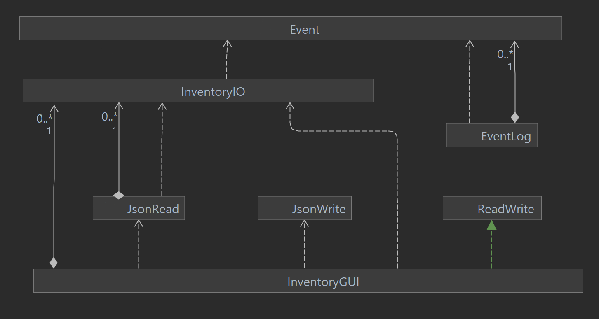

 

# **Inventory.io**

## Inventory.io is a quick and efficient program designed for small retailers to manage their in-store offline inventories. Some features planned for this program include, but are not limited to:
	
- **Ability** to create categories for all the products a retailer has to offer; within these categories, retailers can also add additional sub-categories—allowing them to carry products that meet specific needs.
 Example: Let's say a retailer—who is focusing on computer parts—is selling CPUs, RAM modules, SSDs, and GPUs. Using Inventory.io, this retailer can create specific categories of type, CPU, RAM, SSD, or GPU. The retailer can now add all matching products into said categories, allowing them to separate offerings by their purpose; If needed, they can add additional sub-categories that further distinguish the products by their respective brand offerings.

<space>

- **Ability** to add descriptors for all the products offered, making it relatively easy for employees to add/remove/modify/check a product. Default descriptors include pictures of individual products, information about current stock remaining and where in the store to find it, the current price of a product, the color offerings of a product (if applicable), and product number. (*Additional descriptors can be added using the application*)

<space>

- **Ability** to create unique product IDs for every product presented by the retailer; this makes it easy to track an item down.

<space>

- **Ability** to add/subtract the "x" number of products from stock if the customer refunds/buys it, either by inputting the product ID and "x" number refunded/purchased or allowing a scanner to autofill data. (Scanner autofill is an idea I want to explore, but not my main focus)

## Why am I interesting in making Inventory.io? 
Having a friend whose parents recently started a local business, I have gotten first-hand experience with the challenges of managing in-store inventory. Now, you may wonder, "how does something seemingly so easy, end up being so onerous?" Well, consider this: As a retailer, if you have no idea what is currently present in your inventory, how are you supposed to know if a product is available for sale? 
Arguably, you could make manual adjustments to your inventory counts; however, a single error could result in the mismanagement of stock information—forcing you to call a manual inventory check-up, which results in wasted time—in a market where time is money. Sure, you could buy a commercialized solution to this otherwise local problem, but that most certainly does not come cheap. This cost may be somewhat justified considering most of these commercial offerings are targeted toward big retailers who own multiple stores.
However, as I mentioned earlier, the business owned by my friend's parents—as of right now—is anything but big; these people only own one store and, as such, only require the management of local/in-store inventory. Considering what I've said, wouldn't it make more financial sense for them to go with a cheaper alternative, an alternative such as Inventory.io? Of course it would, and that is my main interest behind creating Inventory.io in the first place, an app made for small retailers to manage their in-store inventory without any headaches and, most importantly, without taking a chunk of their profits.
## User Stories

- A user would be able to create a category CPU, and within this, add multiple sub-categories for the different brands of CPUs. 
<pre>
Example: (CPU)┐
              ├>(Intel)	
              └>(AMD)
</pre>	
- A user would be able to create a sub-category within a sub-category. 
<pre>
Example: (CPU)┐             
              └>(INTEL)┐	
                       └>(i7)
													
</pre>

- A user would be able to add small descriptions for all their products.

- A user would be able to modify current product information and delete categories or products.

- A user would be able to save their inventory.

- A user would be able to reload a saved inventory.

***Side note: If time permits, I want to create the ability to sync inventory data online in the most cost-effective way. If a retailer has multiple stores, this online data will allow them to check/sync stock information with every store. Additionally, if the retailer has an online website, this data could also be shared with customers, allowing them to check online if a product is in stock and, if so, where it might be located.***

# Event Logging

**Sample logged events:**

- Logged event for adding X object to Y:<pre>
Fri Dec 02 01:15:48 PST 2022
New 'Test Object' (X) added to Inventory (Y)
Description set: Testing
Product type set: false
Color set: N/A</pre>

- Logged event for changing the name of X Inventory object:<pre>
Fri Dec 02 01:16:01 PST 2022
New name for 'Test Object' set to: Renamed Test Object</pre>

- Logged event for changing the description of X Inventory object:<pre>
Fri Dec 02 01:16:16 PST 2022
New description for 'Renamed Test Object' set to: Renamed Test Description</pre>

- Logged event for changing product type of X Inventory object:<pre>
Fri Dec 02 01:16:23 PST 2022
New product type for 'Renamed Test Object' set to: true</pre>

- Logged event for changing color of X Inventory object:<pre>
Fri Dec 02 01:16:29 PST 2022
New color for 'Renamed Test Object' set to: Renamed Color</pre>

# Future Improvements

**Changes that would benefit the program:**

- The InventoryGUI class representing the overall GUI for this program would highly benefit from better class cohesion and coupling. The two main issues within the InventoryGUI class are based around code redundancy and unrelated code present within the same scope; this is especially true with the Listeners that are used to report user action. We can fix this by separating different functions of the GUI, where every different class could represent a specific function, making the code easier to read and understand. All of this should mean that we don't have unwanted code that has nothing to do with another present within the same class and also a major reduction in duplicity. 

<space> 

- Code efficiency is also a prominent issue due to the use of recursion within the GUI and Persistence packages of this class; as of right now, the code complexity in relation to Big-O is not up to standard due to it being extremely linear. This linear complexity would be improved with the use of much more efficient searching algorithms. 

<space> 

**UML Diagram**

